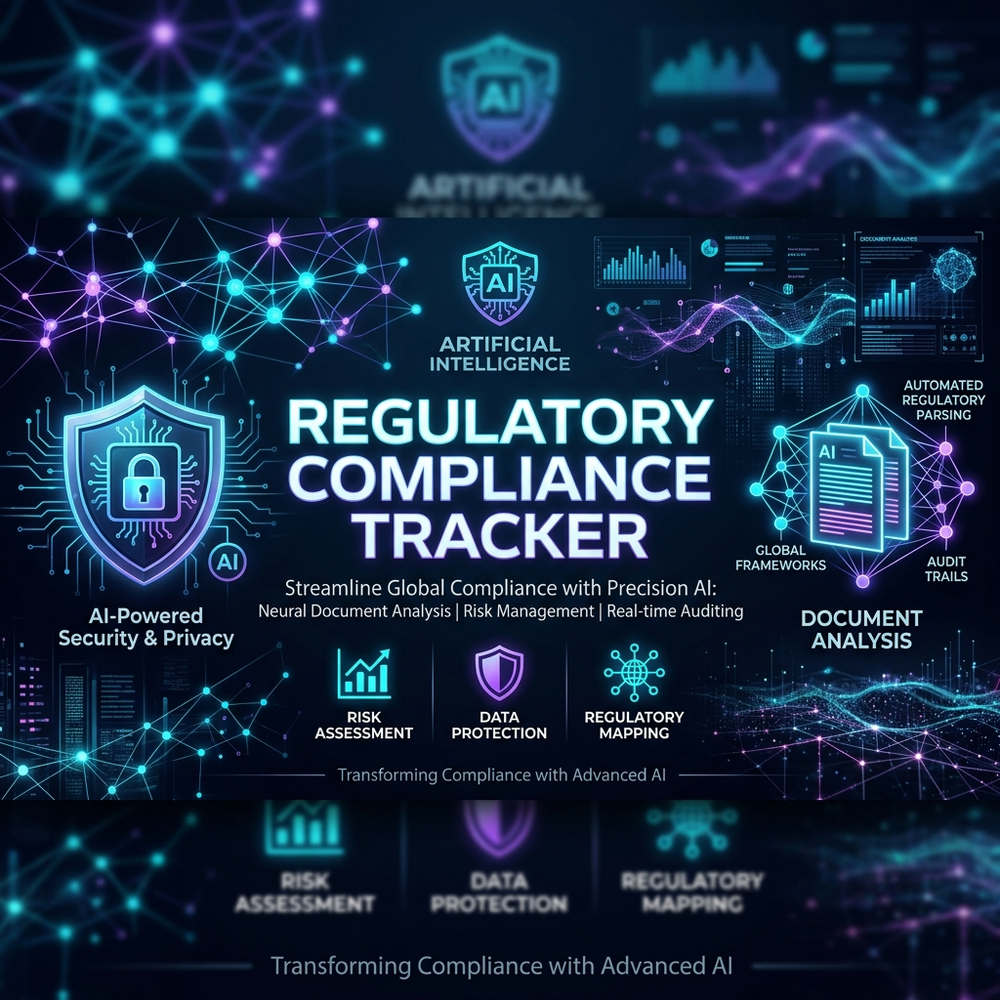
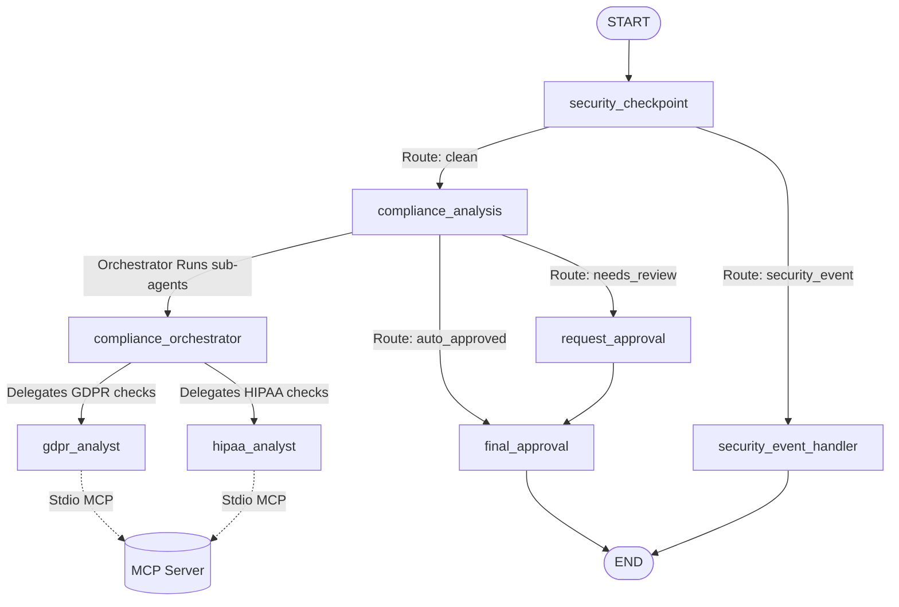
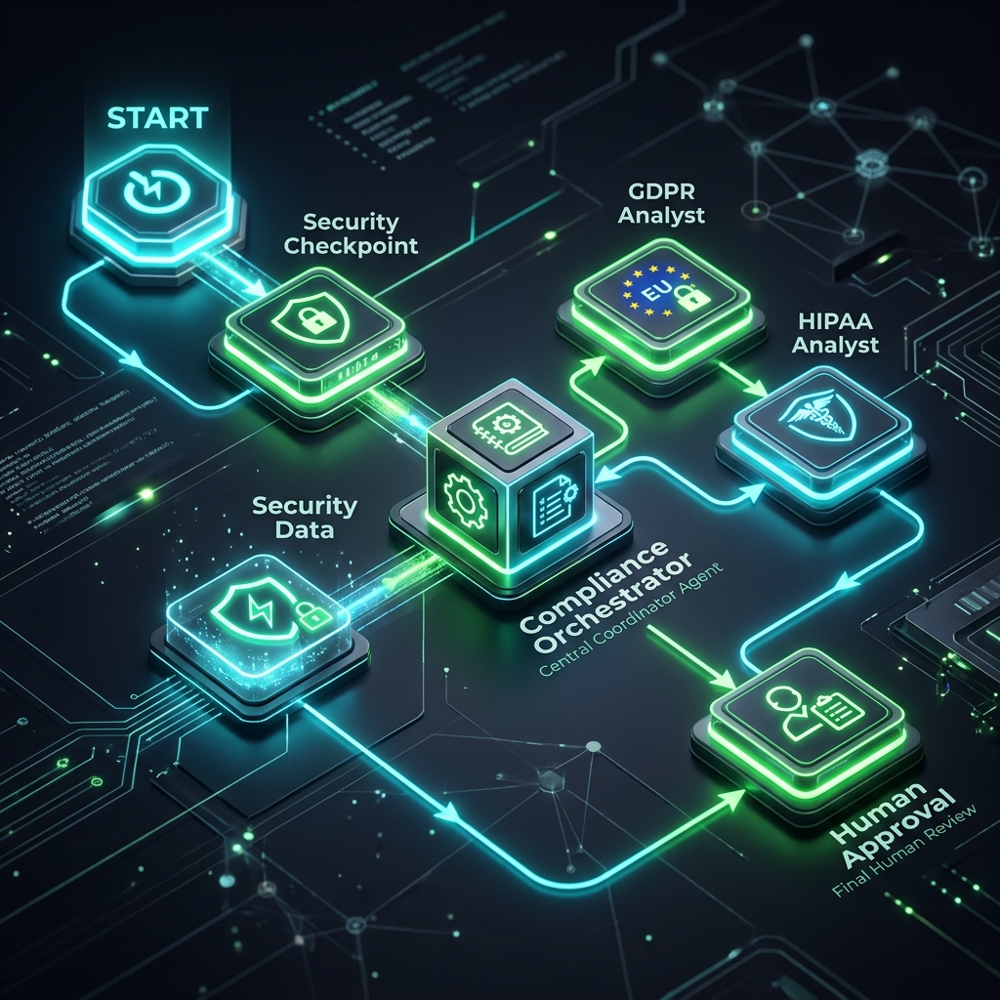

# Regulatory Compliance Tracker (Business Track)


An automated, multi-agent compliance tracking system built using the **Google Agent Development Kit (ADK) 2.0**. It monitors regulatory updates (GDPR, HIPAA, SOC2), compares them against internal company wikis, suggests required policy edits, and routes drafts to compliance officers for human-in-the-loop review.

---

## 🏗️ Multi-Agent Architecture



---

## 📂 Project Structure

```
compliance-tracker/
├── app/
│   ├── agent.py                 # Core workflow nodes & sub-agent configurations
│   ├── mcp_server.py            # FastMCP server exposing policy & regulatory feed tools
│   ├── config.py                # Environment configurations (Gemini Model, API Keys)
│   └── agent_runtime_app.py     # Production entry point
├── tests/
│   └── integration/
│       └── test_agent.py        # Integration test suite
├── Makefile                     # Standard development targets
├── pyproject.toml               # Pinned package dependencies
└── README.md                    # Project documentation
```

---

## ⚡ Quick Start

### 1. Requirements & Setup
Ensure you have Python 3.12+, `uv` package manager, and `agents-cli` installed.

Set up your Gemini API Key in the root `.env` file:
```bash
GEMINI_API_KEY=AIzaSy...
GEMINI_MODEL=gemini-2.5-flash
```

Install the dependencies:
```bash
make install
```

### 2. Launch Playground
To run the interactive ADK development playground:
```bash
make playground
```
Once started, navigate to **http://127.0.0.1:18081** to interact with the compliance tracker interface.

---

## 🔒 Security Features
The `security_checkpoint` runs locally on every input to protect company assets:
* **PII Redaction**: Auto-scrubs SSNs, Credit Cards, and Emails using strict regex patterns.
* **Prompt Injection Defense**: Intercepts jailbreaks (e.g., *“ignore previous instructions”*) and reroutes inputs to a `security_event_handler`.
* **Prohibited Practices Filter**: Ensures no policy draft attempts to unauthorizedly monetize customer data (e.g., *“sell customer data”*).
* **JSON Audit Trail**: Generates a structured JSON log on every action with levels (`INFO`, `WARNING`, `CRITICAL`) stored in the workflow state.

---

## 🛠️ Commands

| Command | Action |
|---------|--------|
| `make install` | Syncs virtual env and installs dependencies |
| `make playground` | Launches local ADK dev web server on port 18081 |
| `make run` | Starts the production runtime application |
| `make test` | Runs the integration test suite |

---

## 🖼️ Assets

### Multi-Agent Architecture Diagram

