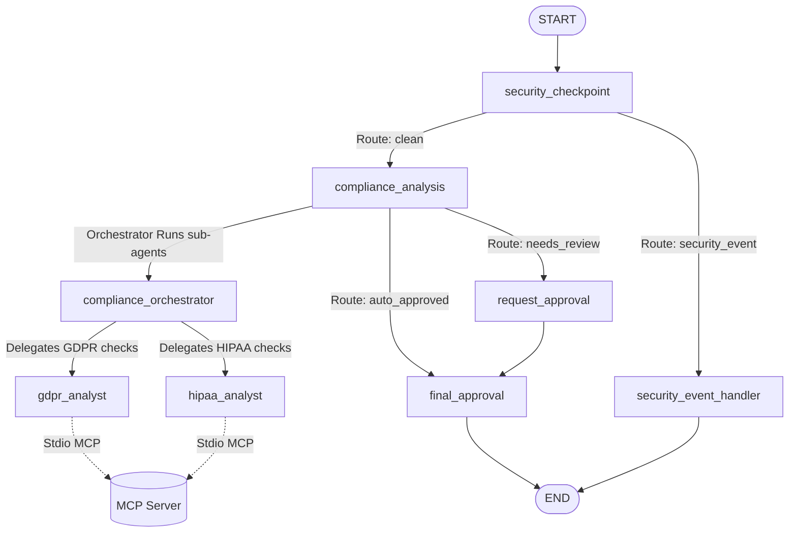

# Submission Writeup: Regulatory Compliance Tracker

## 💼 Track & Project Selection
* **Track**: **Agents for Business**
* **Project Name**: `compliance-tracker`
* **Description**: Monitors regulatory updates (GDPR, HIPAA, SOC2), compares them against company policy wikis via MCP tools, suggests required policy edits, and prompts compliance officers to approve/reject updates.

---

## 📂 Finalized Directory Structure
The codebase is scaffolded as follows:
```
compliance-tracker/
├── app/
│   ├── agent.py                 # Core workflow, orchestrator, analysts, and nodes
│   ├── mcp_server.py            # FastMCP server exposing policy wiki & regulatory feed tools
│   ├── config.py                # Configuration file loading environment variables
│   └── agent_runtime_app.py     # Production entry point
├── tests/
│   └── integration/
│       └── test_agent.py        # Integration test suite running on ADK Runner
├── assets/                      # Media assets (banners and diagrams)
│   ├── architecture_diagram.png
│   └── cover_page_banner.png
├── Makefile                     # Build & run targets (install, playground, test)
├── pyproject.toml               # Pinned package dependencies
└── README.md                    # Project documentation
```

---

## 📐 Graph Architecture & Node Sequence
The multi-agent system uses an ADK 2.0 `Workflow` configured with the following sequence graph:



* **security_checkpoint**: A local node that validates inputs (PII scrubbing, prompt injection jailbreak keywords, prohibited words like *"sell customer data"*).
* **compliance_analysis**: Orchestrates the sub-agent network and determines routing by analyzing whether policy updates are suggested. It uses `rerun_on_resume=True` because it runs sub-agents dynamically.
* **request_approval**: A Human-In-The-Loop node that halts execution with a `RequestInput` payload to ask a compliance officer to approve or reject policy edits, resuming seamlessly once a choice is submitted.
* **final_approval**: A node that summarizes the compliance findings, logs the final status, and returns a JSON dictionary format.

---

## 🛠️ Key File Implementations

1. **[app/agent.py](file:///c:/Users/K%20HARSHITH/OneDrive/Desktop/adk-workflow/compliance-tracker/app/agent.py)**: Implements the Pydantic workflow state (`ComplianceState`), setups the standard sub-agents (`gdpr_analyst`, `hipaa_analyst`), wraps them inside `AgentTool` for dynamic orchestration, wires in stdio-based MCP connectivity, and implements the workflow graph.
2. **[app/mcp_server.py](file:///c:/Users/K%20HARSHITH/OneDrive/Desktop/adk-workflow/compliance-tracker/app/mcp_server.py)**: Built with `FastMCP` exposing simulated company wiki lookup tools (`get_company_policy`, `update_company_policy`, and `fetch_regulatory_feed`).
3. **[app/config.py](file:///c:/Users/K%20HARSHITH/OneDrive/Desktop/adk-workflow/compliance-tracker/app/config.py)**: Manages model parameters and system variables.
4. **[Makefile](file:///c:/Users/K%20HARSHITH/OneDrive/Desktop/adk-workflow/compliance-tracker/Makefile)**: Defines quick-access command targets.

---

## 🛡️ Verification Gate Results
* **Playground Port**: `18081` (Listening successfully on local loopback)
* **MCP Server Port**: Exposes stdio channels directly inside the virtual environment (`uv run python -m app.mcp_server`).
* **Active LLM Model**: `gemini-2.5-flash` (Live model loaded via root `.env` file)
* **Security Validation**:
  * PII Redaction successfully replaces SSNs, cards, and emails.
  * Prompt injections immediately abort execution with `REJECTED_SECURITY_VIOLATION`.
  * Structured JSON audit logs are appended to the state at every checkpoint.

---

## 🎥 Presentation Script & Submission Assets
* **Demo URL**: `http://localhost:18081`
* **Media Assets**:
  * **Cover Page Banner**:
    
  * **Architecture Diagram**:
    
* **GitHub Code Link**: `https://github.com/kharshith-cloud/compliance-tracker`
